---
header-includes:
  - \usepackage[margin=1in]{geometry}
---

# The Final Report (Project Course)
- Author: __YUSUKE SUGIHARA__
- Supervisor: __Dr. GIUSEPPE JURMAN__
- Date: 2024-01-24

# 1. Introduction

## 1.1 Background
Autoencoder is a type of artificial neural network used to learn efficient codings of unlabeled data, typically for the purpose of dimensionality reduction [1]. At its core, autoencoder learns to compress (encode) the input data into a lower-dimensional representation, which called latent feature representation, and then reconstruct (decode) it all the way back to a representation as close as possible to the original input. Since Autoencoder has been used in many applications such as image denoising[2], data compression for image or sound, image generation, anomaly detectoin[3] and so on, it is significantly important to understand what is happening under the hood in Autoencoder, how it works in order to obtain the high accurate model and apply it to the real world problems.

## 1.2 Objective
In this project, I implemented two different types of Autoencoder models on the Brain Tumor Images Dataset from Hugging Face Dataset and reconstructed the images. The first model is a simple Autoencoder(AE), while the second one is a Variational Autoencoder (VAEs)[5]. These models are commonly used for image reconstruction in Autoencoder. The main objectives of this project are to gain a precise understanding of how each model works, clearly explain the differences between Autoencoder and VAEs, compare their performance, visualize the intermediate layers and reconstructed images, and explore the impact of hyperparameter tuning on the results such as batch size, learning rate, and number of epochs and so on. Therefore, the main tasks of this project are as follows:

- Visualize the intermediate layers of each model and explain how they work, as well as the reconstructed images produced by each model.

- Compare the performance of AE and VAEs in terms of image reconstruction and provide an explanation for their respective effectiveness.

- Perform hyperparameter tuning to obtain the best model for image reconstruction.

- Evaluate the trained best model's suitability for image denoising and discuss the results.

# 2. Methodology

## 2.1 Dataset
In this project, I utilized the Brain Tumor MRI Images Dataset from Hugging Face Dataset[4]. The dataset contains 2870 images for training and 394 images for testing. Each image has dimensions of 512 x 512 pixels and is in grayscale format. Some images are scanned horizontally inside the head, while others are scanned vertically as show in Figure 1. In the most left image, the tumor, which is white area in the image, is located around the center of brain. It is considerbly to distinguishi betweeen non head area and head area while it is quite difficult to clearly tell the difference between tumor area and non tumor area, meaning that I woud like to preserve the the shape of each part in brain and their boundaries including brain tumor as much as possible in reconstrucing process.

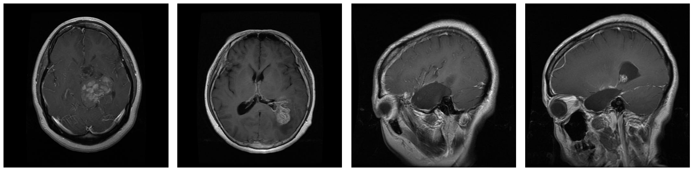 

## 2.2 Preprocessing
Due to computational constraints on my computer, I resized the images to 128 x 128 pixels from 512 x 512 pixels.

## 2.2 Simple Autoencoder(AE) for Image Reconstruction
### 2.2.1 The architecture of AE

As depicted in Figure 2, AE consists of an encoder network and a decoder network. The encoder network takes the input image and compresses it into a lower-dimensional representation, known as the latent feature representation or latent vector. The decoder network takes the latent vector and reconstructs the image to closely resemble the original input. The encoder and decoder networks are symmetrical to each other for the compression and decompression processes. In AE, I utilized 5 convolutional layers for the encoder network and 5 deconvolutional layers for the decoder network. After each Convolution or Deconvolution layer, I applied Batch Normalization (BN). This choice was made to adjust the distribution of each activation, in order to prevent gradient vanishing or exploding during backpropagation, and to accelerate the training process. To tackle the Dying ReLU problem, I used Leaky ReLU as the activation function for each layer. The latent vector is one of the most important hyperparameters that I need to tune. The size of the latent vector plays a crucial role in the performance of the autoencoder. A smaller latent vector size allows for higher compression capability, enabling the model to generalize better to unseen data and avoid overfitting by not memorizing unnecessary details. However, this compression process may result in the loss of important information. On the other hand, a larger latent vector size allows the autoencoder to capture more details and nuances of the input image data, leading to higher fidelity in image reconstruction. But, there is a risk of overfitting as the model may end up memorizing only the training data, reducing its ability to generalize to new datasets. Therefore, finding the optimal latent vector size is also crucial to balance the benefits and drawbacks of each size. I used Mean Squared Error (MSE) as the loss function for the reconstruction process called restruction loss in AE.

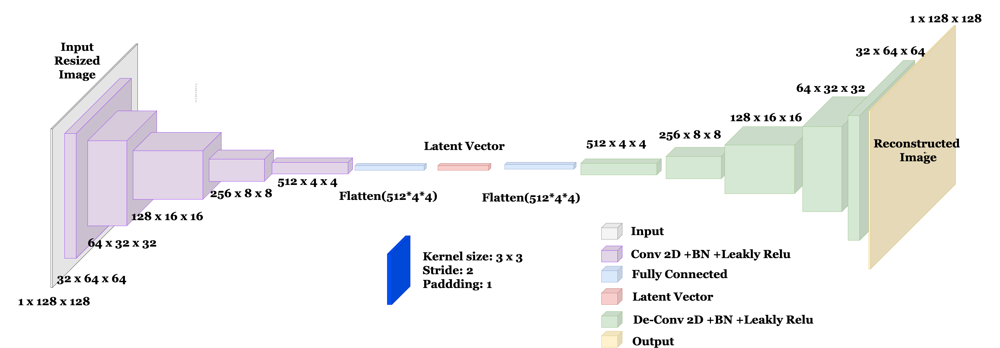

## 2.3 Variational Autoencoder (VAEs) for Image Reconstruction
### 2.3.1 The architecture of VAE
#### Architecture
A Variational Autoencoder (VAEs) is a type of autoencoder that uses probabilistic encoders and decoders to generate and reconstruct data, focusing on learning the distribution of the data. The key difference between AE and a VAEs is that while a AE learns to replicate its input to its output, VAEs learns the parameters of the probability distribution representing the data, enabling it to generate new data similar to the input. The architecture of VAEs can be seen in Figure 3. As AE, I created 5 convolutional layer for both encoder and decoder network and applied Batch Normalization (BN) and Leaky ReLU as the activation function for each layer. The kernal size, stride and padding for each layer is also the same as AE architecture that I explained in the previous section. In the VAEs, the encoder outputs mean $\mu$ and standard deviation $\sigma$ of a Gaussian distribution to represent the latent space. Direct sampling from this distribution is not feasible for neural network training due to the non-differentiable nature of the stochastic sampling process. To overcome this, VAEs employ the reparameterization trick, where an auxiliary variable $\epsilon$ is sampled from a standard Gaussian distribution (N(0,1)). The latent variable z is then computed as z = $\mu + \sigma \odot \epsilon$, with $\odot$ denoting element-wise multiplication. This method maintains the stochastic nature essential for the VAE’s generative process and enables gradient computation for backpropagation. The introduction of $\epsilon$ allows the VAEs to learn a distribution over the latent space rather than fixed points, fostering a continuous and smooth latent space. This is critical for the model's training using standard optimization techniques and enhances its ability to generate new data samples that are realistically similar to the training data. 

#### Loss Function
I used the restruction loss using cross entropy loss and KL divergence loss as the loss function for the VAEs. The KL divergence loss is used to measure the difference between two probability distributions. 

The Reconstruction Loss using Binary Cross-Entropy (BCE) is given by:

$$ \text{BCE} = -\frac{1}{N} \sum_{i=1}^{N} \left[ x_i \log(\hat{x}_i) + (1 - x_i) \log(1 - \hat{x}_i) \right] $$

$$ \text{where } x_i \text{ is the original input, } \hat{x}_i \text{ is the reconstructed input, and } N \text{ is the number of data points.}$$
This loss measures how well the VAE can reconstruct the input data.

The Kullback-Leibler (KL) Divergence is used to regularize the latent space and is calculated as:

$$ \text{KL Divergence} = -\frac{1}{2} \sum_{j=1}^{J} \left(1 + \log(\sigma_j^2) - \mu_j^2 - \sigma_j^2 \right) $$

$$ \mu_j \text{ and } \sigma_j \text{ are the mean and standard deviation of the latent variables for each dimension } j \text{ in the latent space,}$$
$$ \text{ and } J \text{ is the dimensionality of the latent space. This component encourages the distribution of}$$ 
$$ \text{the latent variables to approximate a prior distribution, usually a standard normal distribution.}$$

The Total Loss for VAEs combines the Reconstruction Loss and the KL Divergence:

$$ \text{Total Loss} = \text{BCE} + \text{KL Divergence} $$

This combined loss ensures that the model learns efficient representations of the data while also maintaining a regularized latent space suitable for generative tasks. In the VAEs, I decided which model is the best for image reconstruction based on this total loss.

.png>)

## 2.4 Hyperparameter Optimization
### 2.4.1 Hyperparameter Optimization
In this project, I utilized Weights and Biases[6] for hyperparameter optimization. Weights and Biases(W&B) is a machine learning experiment tracking tool that helps to visualize and understand the training process. It also provides a hyperparameter optimization tool called Sweeps. Sweeps is a tool that helps to automate hyperparameter optimization. It allows users to define a search space of hyperparameters and Sweeps will automatically try different combinations of hyperparameters to find the best model. In this project, I used Sweeps to find the best model for image reconstruction. The different combinations of hyperparameters for a Simple Autoencoder and VAEs are shown in Table 1 and 2, respectively.
The search method is Baysian optimization for both models.
The reason why I chose Bayesian optimization is because unlike grid or random search, Bayesian optimization makes decisions about which hyperparameters to test next based on past results, aiming to find the best hyperparameters with fewer iterations.

| Parameter     | Values              |
|---------------|---------------------|
| Learning Rate |[1e-3, 5e-4, 1e-4]  |
| Epochs      | [10, 20, 40]        |
| Batch Size  |[16, 32, 64]        |
| Latent Dim  |[512, 1024, 2048]   |

Table 1. The hyperparameters used in W&B Sweeps for AE.

| Parameter     | Values              |
|---------------|---------------------|
| Learning Rate |[1e-3, 5e-4, 1e-4]  |
| Epochs      | [10, 20, 40]        |
| Batch Size  |[16, 32, 64]        |
| Latent Dim  |[512, 1024, 2048]   |

Table 2. The hyperparameters used in W&B Sweeps for VAEs.

## 2.5 Denoising Autoencoder
Since one of the most popular applications of Autoencoder is image denoising, I explored the possibility of using the trained best Autoencoder model for image denoising. I added Gaussian noise to the test images and fed them into the trained best model to evaluate its capability to denoise the images. The example of denoising process can be seen in Figure 4. Since autoencoder only extracts the prominent features of the input images, it is expected that the model can remove unimportant details such as noise and preserve the important features such as the shape of digits in the decoding process in this example. 

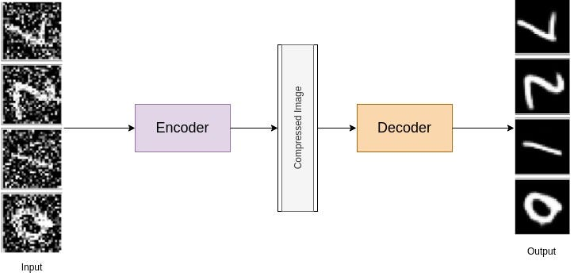

Image source from [https://medium.com/analytics-vidhya/reconstruct-corrupted-data-using-denoising-autoencoder-python-code-aeaff4b0958e]

# 3. Result and Discussion
## 3.1 Image Reconstruction

### 3.1.1 The hyperparameter optimization for Autoencoder and VAEs.

Using the hyperparameter optimization tool, I experimented with a total of 17 different combinations of hyperparameters for AE and a total of 61 combinations of hyperparametes for VAEs. Through this process, I found the best model for image reconstruction of the brain images. The loss curve for each combination of hyperparameters in the top 10, based on the average loss over all batches, is shown in Figure 5 and Figure 6. The best model achieved the lowest loss value of 0.003926 for AE and 97322.52 for VAEs, respectively. The reason why the loss value of VAEs is significantly higer than AE is because VAEs utilizes not only the reconstruction loss but also the KL divergent loss as I mentioned in the previous section. 

The hyperparameter optimization process, known as Sweeps in W&B, for AE and VAEs are visualized in Figure 7 and Figure 8, respectively. They allow for a more intuitive understanding of the impact of each hyperparameter on the loss value. From these results of both AE and VAEs, it can be observed that a smaller batch size tends to result in a lower loss value. This is because each batch has fewer data points, allowing for more frequent updates of the model parameters and potentially a more precise fit to each specific batch of data. However, using a small batch size can lead to increased computational time due to less efficient utilization of parallel processing capabilities. It may also result in higher variance in the parameter updates, potentially leading to less stable convergence or getting stuck in local minima instead of global minima because each small batch may not represent the overall data distribution accurately.

The hyperparemters of the best model for AE and VAEs are shown in Table 3 and Table 4, respectively. The link to the hyperparameter optimization process for AE and VAEs is shown below:

- __AE__: https://wandb.ai/yusuke-sugihara/UNITN-Project_AE_Opt/sweeps/w0f76ugb/workspace?workspace=user-yusuke-sugihara

- __VAEs__: https://wandb.ai/yusuke-sugihara/UNITN-Project_VAE_Opt_1/sweeps/21jlprfb/workspace?workspace=user-yusuke-sugihara

| Parameter     | Values              |
|---------------|---------------------|
| Learning Rate | 5e-4               |
| Epochs      | 40                  |
| Batch Size  | 16                  |
| Latent Dim  | 512                |

Table 3. The hyperparameters for the best model of AE.

| Parameter     | Values              |
|---------------|---------------------|
| Learning Rate | 1e-3            |
| Epochs      | 40                  |
| Batch Size  | 16                  |
| Latent Dim  | 512                |

Table 4. The hyperparameters for the best model of VAEs.

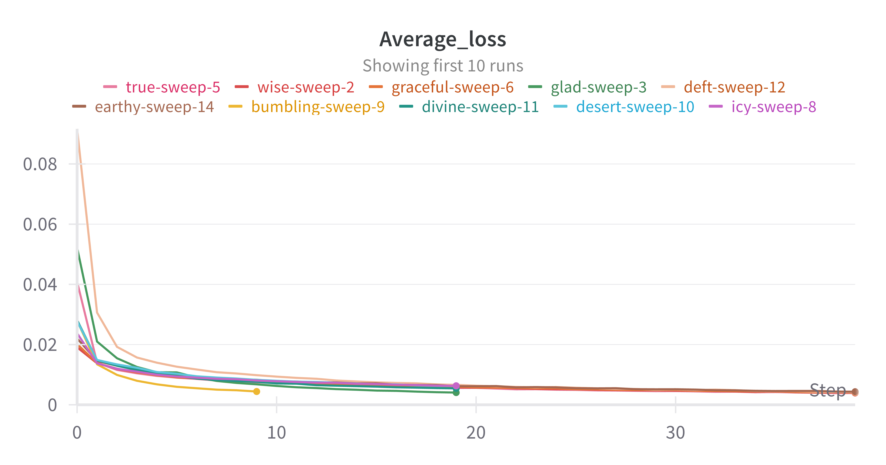

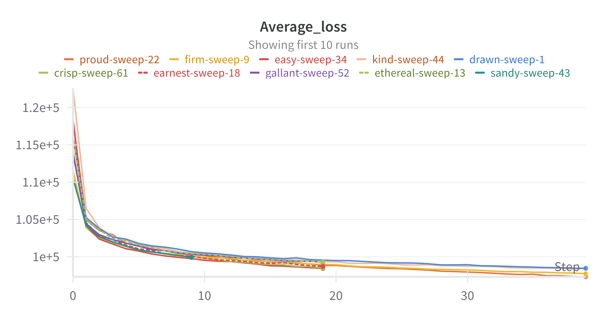

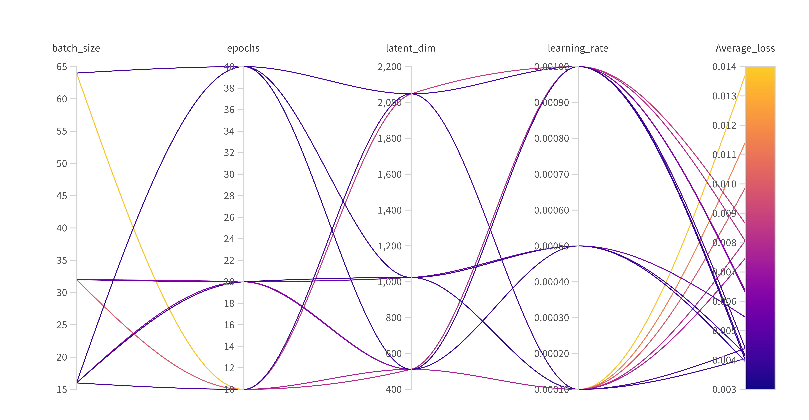

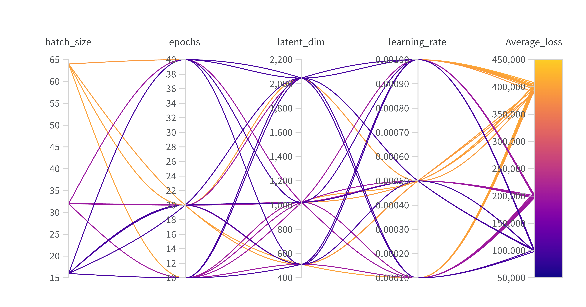

#### 3.1.2 The result of image reconstruction with the best model of AE and VAEs.

The comparison between the original images and the reconstructed images using the best model of AE and VAEs are shown in Figure 9 and Figure 10, respectively. In AE, the reconstructed images are quite similar to the original images. For example, in the left and right most original brain images of AE, the brain tumor can be clearly seen with white color and they are also recognized in the reconstructed images as well. Also, cavities and wrinkles around skull in the brain can be reproduced in the reconstructed images as well. These results in AE indicate that the best trained model of the Autoencoder can capture and preserve the shape of each part in brain and their boundaries quite well especially in the area where black and white colors are clearly differentiated. This is probably because in image processing, especially with autoencoders and similar models, black and white areas, which exhibit high contrast, are more readily and accurately reproduced in reconstructed images. This higher contrast provides strong, distinct signals, simplifying the learning and reproduction process for the model compared to subtler color variations. Additionally, black and white separations often align with simple, well-defined edges or shapes, making these features less complex and easier to encode and decode than intricate textures or gradients. When an image is compressed, as happens in an autoencoder's bottleneck, these high-contrast and simpler features are less prone to information loss, enhancing the accuracy of reconstructed areas. Moreover, many image processing algorithms, particularly convolutional neural networks (CNNs), excel at edge detection, and the clear edges formed by black and white separations are efficiently identified and reconstructed by these models.

 On the other hand, the reconstructed images in VAEs are quite blurry compared to the original images, meaning that trainining model in VAEs is not sufficient as AE. This is probably because in VAEs, the encoding process incorporates stochasticity, where inputs are mapped to distributions in the latent space rather than to deterministic points. And also this design choice introduces variability during the decoding phase, as a specific sample is drawn from the latent distribution for reconstruction. Consequently, this can lead to reconstructions that are less precise when compared to those generated by AE. Moreover, VAEs are characterized by a dual optimization objective: they minimize not only the reconstruction loss but also the KL divergence. The latter serves to regularize the latent space, encouraging it to conform to a normal distribution. This regularization, while instrumental in structuring the latent space effectively, can sometimes conflict with the goal of perfect reconstruction, a contrast to AE that exclusively concentrate on minimizing reconstruction errors.

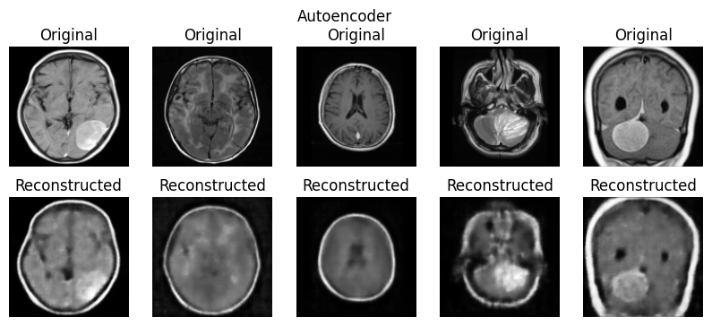

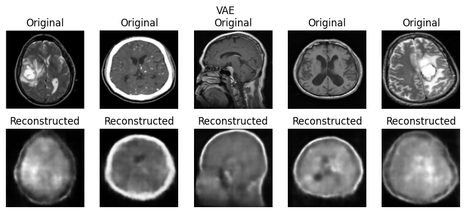

#### 3.1.3  The visualization of the intermediate layers in AE and VAEs.

I visualized the output of the intermediate layers in AE and VAEs to better understand how the model captures and compresses different levels of features in the encoding process and how the reconstruction process is able to translate the abstract, compressed features back into a spatially coherent form.
The visualization of the intermediate layers in AE and VAEs are shown in Figure 11and Figure 12, respectively. The analysis of the output from each layer in AE is as follows:

__Encoder Convolution Layers of Autoencoder:__

__enc_conv1:__ This layer likely captures prominent features such as edges or boundary between brain area and non-brain area or between each part in brain. Even though the output still resembles the original image, it begins to abstract away some details.

__enc_conv2:__ As it goes deeper, this layer extracts more complex features like basic shapes and specific textures within the brain, reducing spatial resolution further and beginning to lose some finer details. For example, detailed information such as brain wrinkles is loss, but the shape of each part in brain is still preserved.

__enc_conv3:__ At this stage, the network captures higher-level features while significantly reducing the dimensionality of the image, causing the output to look more abstract and less recognizable.

__enc_conv4:__ This layer abstracts the data even further, capturing more complex and high-level features while continuing to reduce spatial resolution and detail.

__enc_conv5:__ The final encoder layer output is a highly abstract representation that encodes the most critical features needed to reconstruct the input image. For example, the most right brain image has a clear white area in the center of the brain in the original image and this white area is also clearly seen in the output of this layer. This indicates that this layer captures the most important features of the brain images.

__Decoder Convolution Layers of Autoencoder:__

__dec_conv1:__ Starting the reconstruction process, this layer begins to reshape the abstract representation back into a form with increased spatial resolution.

__dec_conv2:__ As the decoding process progresses, this layer further improves the reconstruction by restoring more details and structure to the output. At this stage, the shape of the brain is starting to become recognizable, although the color contrast within the brain area appears to be random.

__dec_conv3:__ This layer further improves the spatial resolution and starts to bring back recognizable features from the abstract representation. At this stage, the basic shape of skeleton of brain is recognizable probably because the boundary between brain area and non-brain area is one of the most prominent feature maps in the brain images, which allows the model to reconstruct the shape of brain at a relatively early stage.

__dec_conv4:__ The boundary between brain area and non-brain area is more clearly seen in this layer. Also, the shape of each part in brain such as tumor, eye, or cavity is starting to become recognizable.The visualization of the intermediate layers in AE

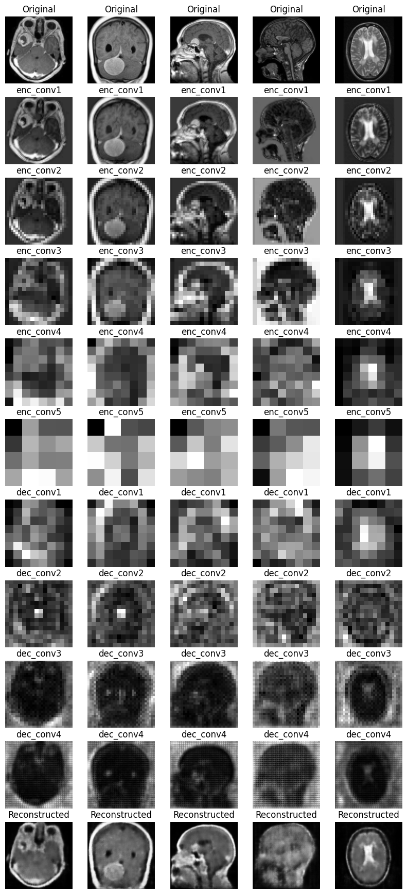

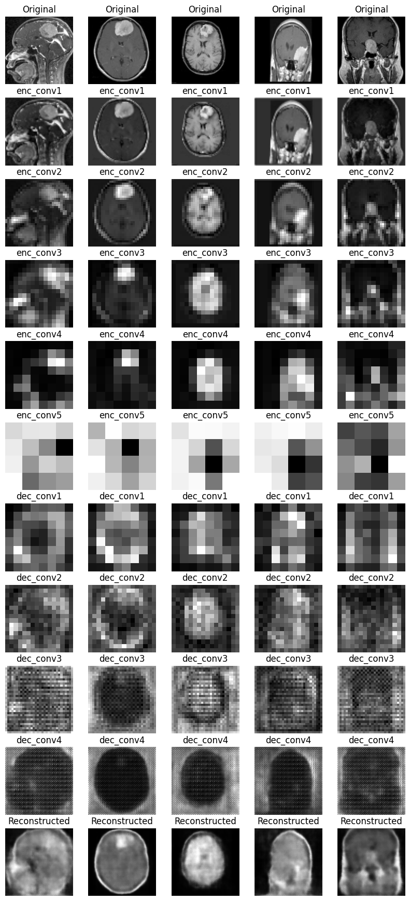

## 3.2 Denoising Autoencoder using the best model
One of the most common applications of Autoencoders is image denoising. They are capable of capturing and preserving important features of input images while removing unimportant details such as noise. In the previous section, I found the best model for image reconstruction in AE and evaluated its performance. In this section, I explored the robustness of the best model for image denoising. I added Gaussian noise to the test images and fed them into the trained model to see if it can remove the noise and reconstruct the images without leaving any artifacts. The results of the denoising process are shown in Figure 13. As can be seen, the model successfully removed the strong noise and reconstructed the images quite well overall. However, during the reconstruction process, the model might have also removed some important features, such as the brain tumor in the second image from the right. This could be because the model had difficulty distinguishing between the noise and the brain tumor during the encoding and decoding process.

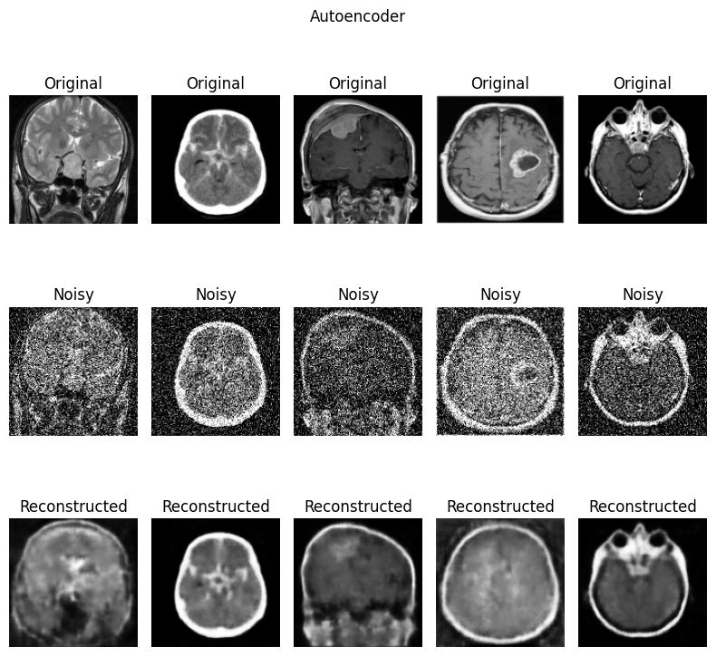

# 4. Future Work
I would like to explore the following topics to improve the performance of the model in image reconstruction problem in the future.

- __Data preprocessing:__ Since I did not apply any data preprocessing techniques, I would like to explore the impact of data preprocessing such as normalization on the performance of the model in image reconstruction problem.

- __Hyperparameter optimization:__ I would like to add other hyperparameters such as the number of filters, the size of the kernel, and the stride to the hyperparameter optimization process and further explore different combinations of hyperparameters using sweeps in W&B to find the optimal model for image reconstruction.

- __Improve the performance of the model:__
In order to improve the model performance, I also would like to explore some different models such as U-Net and Autoencoders with Skip Connections.

# 5. Conclusion
In this project, I implemented two different types of Autoencoder models on the Brain Tumor Images Dataset from Hugging Face Dataset and reconstructed the images. The first model is a simple Autoencoder(AE), while the second one is a Variational Autoencoder (VAEs). After I performed hyperparameter tuning to obtain the best model for image reconstruction, I visualized not only reconstructed images but also the intermediate layers in AE and VAEs to better understand how they work. At the end, I explored the possibility of using the trained best model for image denoising. The main findings of this project are as follows:

- The best model of AE can capture and preserve the shape of each part in brain and their boundaries quite well especially in the area where black and white colors are clearly differentiated. 

- The best model of VAEs is not sufficient as AE in image reconstruction problem. This is probably because in VAEs, the encoding process incorporates stochasticity, where inputs are mapped to distributions in the latent space rather than to deterministic points. And also this design choice introduces variability during the decoding phase, as a specific sample is drawn from the latent distribution for reconstruction.

- The visualization of the intermediate layers in Autoencoders (AEs) offers insightful observations into how these models process and reconstruct complex image data, highlighting the gradual transition from capturing basic features to reconstructing detailed, spatially coherent structures.

- The best model of AE can remove the strong noise and reconstruct the images quite well overall. However, during the reconstruction process, the model might have also removed some important features, such as the brain tumor.

# Bibliography
[1] Zhai, J., Zhang, S., Chen, J., & He, Q. (2018). Autoencoder and Its Various Variants. In 2018 IEEE International Conference on Systems, Man, and Cybernetics (SMC).

[2] Vincent, P., Larochelle, H., Lajoie, I., Bengio, Y., & Manzagol, P. (2010). Stacked Denoising Autoencoders: Learning Useful Representations in a Deep Network with a Local Denoising Criterion. J. Mach. Learn. Res., 11, 3371-3408. https://doi.org/10.5555/1756006.1953039.

[3] Sakurada, M., & Yairi, T. (2014). Anomaly Detection Using Autoencoders with Nonlinear Dimensionality Reduction. , 4. https://doi.org/10.1145/2689746.2689747.

[4]dataset:https://huggingface.co/datasets/benschill/brain-tumor-collection

[5] Kingma, D. P., & Welling, M. (2014). Auto-Encoding Variational Bayes. arXiv. 
https://doi.org/10.48550/arXiv.1312.6114

[6]Weights and Biases https://wandb.ai/site
